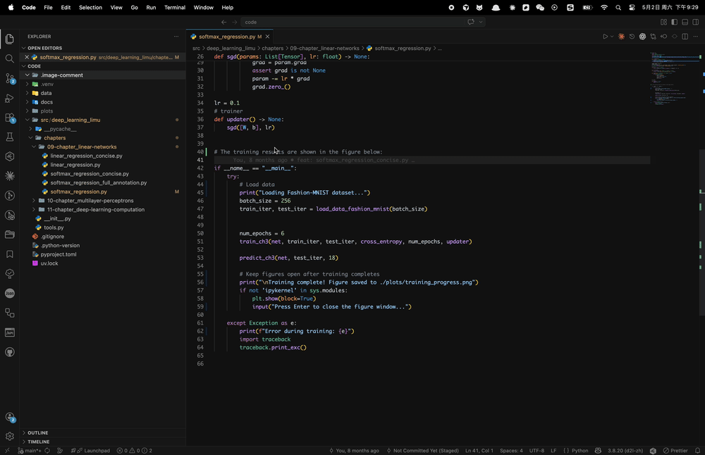

# Image Comment - VSCode Extension

A VSCode extension that automatically saves pasted images and inserts comment references.

[English](./README.md) | [简体中文](./README.zh-CN.md)

## ✨ Features

- 🖼️ **Auto-detect image paste**: Automatically detects images in clipboard (supports screenshots, copied image files, etc.)
- 💾 **Auto-save images**: Saves images to a specified folder in the project directory (default: `.image-comment`)
- 📝 **Auto-insert comments**: Automatically inserts image reference comments at the paste position
- 🔧 **Smart comment format**: Automatically selects appropriate comment format based on file type (JavaScript, Python, HTML, Markdown, etc.)
- 👀 **Quick preview & delete**: Provides inline CodeLens actions to preview image comments and delete comment + image together
- 🎨 **Visual decorations**: Supports image comment line highlight and gutter icons for better readability
- 🌍 **Multi-platform support**: Supports macOS and Windows

## 📦 Installation

[Install from Marketplace](https://marketplace.visualstudio.com/items?itemName=hekaigustav.image-comment) | Search "Image Comment" in VS Code Extensions panel and install

## 🚀 Usage

The following demo shows pasting an image from the clipboard, saving it under the workspace, and using inline preview/delete on the inserted comment.

1. Copy an image to clipboard (screenshot, copy image file, copy from browser, etc.)
2. Right-click in the code editor and select **"Paste Image as Comment"**

   
3. The extension will automatically detect the image, save it to the `.image-comment` folder, and insert a comment at the current position
4. For inserted image comments, use inline actions **"Preview"** and **"Delete"** above the comment line

## ⚙️ Configuration Options

| Configuration | Type | Default | Description |
| :--- | :--- | :--- | :--- |
| `imageComment.saveDirectory` | string | `.image-comment` | Directory name to save images (relative to workspace root) |
| `imageComment.commentTemplate` | string | `` | Comment template, use `{path}` as placeholder for image path |
| `imageComment.useRelativePath` | boolean | `true` | Whether to use relative path in comments |
| `imageComment.enableDecorations` | boolean | `true` | Enable visual decorations for image comments |
| `imageComment.showGutterIcon` | boolean | `true` | Show gutter icon for image comment lines |
| `imageComment.highlightBackground` | boolean | `true` | Highlight image comment line background |

## 🆕 Recent Updates

- Added inline preview/delete actions for image comments
- Added image comment visual decorations (gutter icon and background highlight)
- Improved i18n and locale coverage

## 💻 System Requirements

- **macOS**: No additional tools required
- **Windows**: Requires PowerShell (pre-installed on Windows 10+)

## ❓ FAQ

**Q: Why is "Paste Image as Comment" not showing in the context menu?**
A: Make sure the editor has focus, is not in read-only mode, and no text is selected.

**Q: Why can't I see "Preview" / "Delete" above an image comment?**
A: These inline actions are shown only when the current line matches a valid image comment pattern generated by your configured `imageComment.commentTemplate`, and the referenced image path can be resolved. If they are missing, check whether the comment text still matches the template and whether the image file path is correct.

**Q: Where are images saved?**
A: By default, images are saved in the `.image-comment` folder in the workspace root. You can change the save location by modifying `imageComment.saveDirectory` in settings.

**Q: What image formats are supported?**
A: Supports common image formats such as PNG, JPEG, GIF, WebP, BMP, SVG. Maximum size is 50MB.

## 📄 License

MIT License

---

If this extension is helpful to you, please give it a ⭐ Star!
