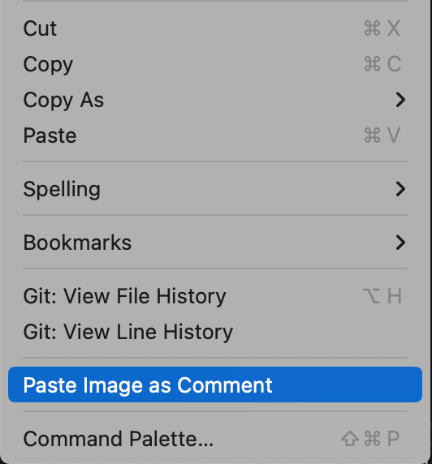

# Image Comment - VSCode Extension

一个 VSCode 扩展，用于自动保存粘贴的图片并插入注释引用。

[English](./README.md) | [简体中文](./README.zh-CN.md)

## ✨ 功能特性

- 🖼️ **自动检测图片粘贴**：自动检测剪贴板中的图片（支持截图、复制图片文件等）
- 💾 **自动保存图片**：将图片保存到项目目录下的指定文件夹（默认：`.image-comment`）
- 📝 **自动插入注释**：在粘贴位置自动插入图片引用注释
- 🔧 **智能注释格式**：根据文件类型自动选择合适的注释格式（JavaScript、Python、HTML、Markdown 等）
- 🌍 **多平台支持**：支持 macOS、Windows 和 Linux

## 📦 安装

[从市场安装](https://marketplace.visualstudio.com/items?itemName=hekaigustav.image-comment) | 在 VS Code 扩展面板搜索 "Image Comment" 并安装

## 🚀 使用方法

1. 复制图片到剪贴板（截图、复制图片文件、从浏览器复制等）
2. 在代码编辑器中右键点击，选择 **"粘贴图片为注释"**

3. 插件会自动检测图片、保存到 `.image-comment` 文件夹并在当前位置插入注释

## ⚙️ 配置选项

| 配置项 | 类型 | 默认值 | 说明 |
| :--- | :--- | :--- | :--- |
| `imageComment.saveDirectory` | string | `.image-comment` | 图片保存目录名称（相对于工作区根目录） |
| `imageComment.commentTemplate` | string | `` | 注释模板，使用 `{path}` 作为图片路径的占位符 |
| `imageComment.useRelativePath` | boolean | `true` | 是否在注释中使用相对路径 |

## 💻 系统要求

- **macOS**：无需额外工具
- **Windows**：需要 PowerShell（Windows 10+ 默认已安装）
- **Linux**：需要安装 `xclip`（`sudo apt-get install xclip` 或相应发行版的包管理器）

## ❓ 常见问题

**Q: 为什么右键菜单中没有 "粘贴图片为注释" 选项？**
A: 请确保编辑器处于焦点状态、不是只读模式，且没有选中任何文本。

**Q: 图片保存在哪里？**
A: 默认保存在工作区根目录下的 `.image-comment` 文件夹中。可在设置中修改 `imageComment.saveDirectory`。

**Q: 支持哪些图片格式？**
A: 支持 PNG、JPEG、GIF、WebP、BMP、SVG 等常见格式，最大 50MB。

## 📄 许可证

MIT License

---

如果这个扩展对你有帮助，欢迎给个 ⭐ Star！
